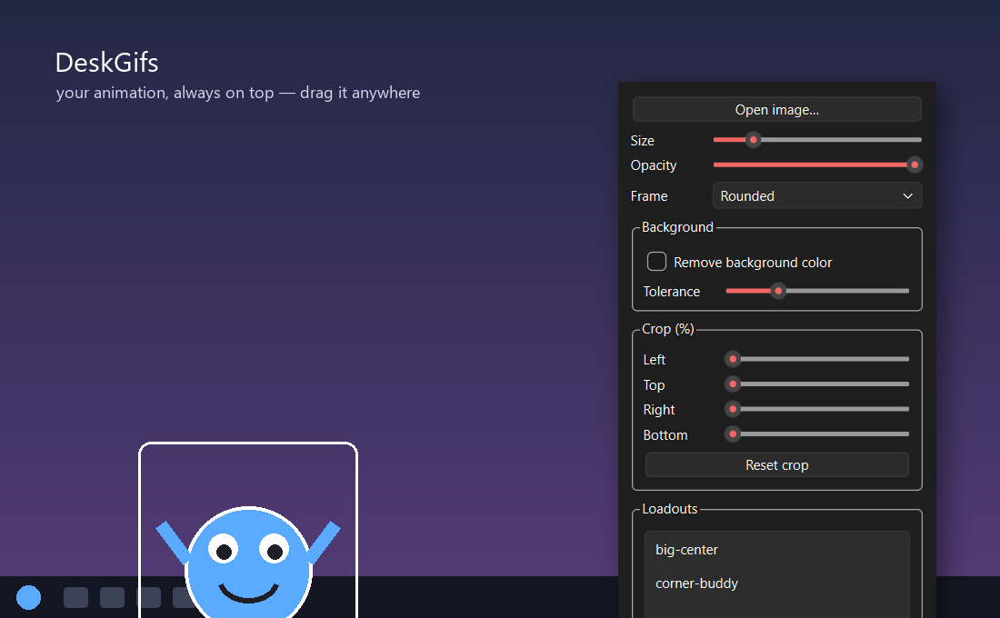

# DeskGifs

A tiny desktop toy: loops an animated **GIF / WebP / APNG** in a frameless,
transparent, always-on-top window you can drag anywhere on your desktop.
Windows only.



*(Sample character shown; DeskGifs ships without any animation — bring your own.)*

- **Left-click drag** to move it
- **Double-click** to open the control panel
- **Mouse wheel** over it to resize
- **Right-click** for a menu (show controls / quit)
- Stays in front of everything, including the taskbar
- Transparent background shows through cleanly (transparent WebP looks smoothest)

## Download (no Python needed)

Grab **`DeskGifs.exe`** from the
[latest release](https://github.com/Dadpops/DeskGifs/releases/latest), put it
anywhere, and double-click it. Then click **Open image…** to pick your
animation. (Windows SmartScreen may warn about an unknown publisher on first
run — click *More info → Run anyway*; that's normal for unsigned hobby apps.)

## Quick start (from source)

```powershell
git clone https://github.com/Dadpops/DeskGifs.git
cd DeskGifs
pip install -r requirements.txt
python desk_gif.py
```

You supply your own animation file — the app ships without one. On first launch
either click **Open image…** in the control panel to pick a GIF/WebP/APNG, or
drop a file named `robin_dance.gif` next to the script and it loads
automatically. (See *Swap in a different animation* below to change the default.)

> **Bring your own assets.** No animation files are included in this repo. Use
> your own, and respect the copyright of anything you didn't make.

## Control panel

A small **Controls** window opens alongside the animation. From it you can:

- **Open image…** — swap in a different GIF / WebP / APNG on the fly (no code edits)
- **Size** — scale the animation up or down (also works with the mouse wheel)
- **Opacity** — fade it from 10% to 100%
- **Frame** — pick a border style: None, Thin line, Thick line, Black line,
  Rounded, Rounded thick, Double line, or Corners (the area around the animation
  stays transparent)
- **Remove background color** — many GIFs have a solid color (often white)
  painted *into* the image. Tick this to key that color out so you only see the
  character, not the box. The color is auto-detected from the corners; use the
  **Tolerance** slider to knock out more/less of it (higher = more aggressive).
- **Crop** — trim any amount off the left / top / right / bottom edges, with a
  *Reset crop* button

Closing the panel just hides it (the animation keeps running). Right-click the
animation → **Show controls** to bring the panel back. Only **Quit** actually
exits.

## Loadouts (saved presets)

Set up the animation exactly how you like it — image, size, position, opacity,
frame, background removal, crop — then click **Save current…** under *Loadouts*
and give it a name. Click a name in the list any time to instantly restore that
whole setup, including where it sat on screen. **Delete** removes the selected
one. Loadouts are stored in `settings.json`, so they persist between runs.

## Settings are saved

Your current setup — image, size, opacity, frame, background removal, crop, and
on-screen position — plus all loadouts are saved to `settings.json` next to the
script and restored next time you launch. Delete that file to reset to the
defaults in `desk_gif.py`.

## Install

Requires Python 3.9+.

```powershell
pip install -r requirements.txt
```

(`PyQt6` for the window, `Pillow` for decoding frames, `numpy` for background
removal.)

Drop your animation file in the project root. The default expected file is
`teen-titans-teen-titans-go.gif`.

## Run

```powershell
python desk_gif.py
```

### Run without keeping a terminal open

You have two options:

**1. Double-click the `.pyw` (quick, needs Python installed).**
`desk_gif.pyw` runs under `pythonw`, so no console window appears. Just
double-click it in Explorer, or:

```powershell
pythonw desk_gif.pyw
```

**2. Build a standalone `.exe` (a real app, no Python needed to run it).**
Double-click **`build_exe.bat`** (or run it from a terminal). It produces
`dist\DeskGifs.exe`, which you can move anywhere, pin to the taskbar, or make a
desktop shortcut for. Keep your animation file next to the `.exe`, or just use
**Open image…** in the panel — your `settings.json` and loadouts are written
beside the `.exe`.

> The app stays **in front of everything, including the taskbar** — it re-asserts
> itself as top-most a couple of times a second.

## Swap in a different animation

Easiest: click **Open image…** in the control panel.

To change the *default* image loaded at startup, edit the config block near the
top of `desk_gif.py`:

```python
ANIMATION_PATH = "teen-titans-teen-titans-go.gif"   # .gif / .webp / .png (APNG)
```

Relative paths are resolved next to the script, or give a full path like
`ANIMATION_PATH = r"C:\Users\me\Pictures\cat.webp"`. Set it to `""` to start
with no image and pick one from the panel.

## Starting size / opacity

Use the panel sliders at runtime, or set the startup defaults in `desk_gif.py`:

```python
START_SIZE = 200      # longest side in pixels; None = the file's native size
START_OPACITY = 1.0   # 0.1 - 1.0
```

## Auto-launch on login

A helper manages a shortcut in your Windows Startup folder (runs silently via
`pythonw`, no console window):

```powershell
python autostart.py enable    # start automatically at login
python autostart.py disable   # stop starting at login
python autostart.py status    # check current state
```

Under the hood `enable` creates `DeskGifs.lnk` in
`%APPDATA%\Microsoft\Windows\Start Menu\Programs\Startup`. You can also remove
it by hand: press `Win+R`, type `shell:startup`, and delete the shortcut.
